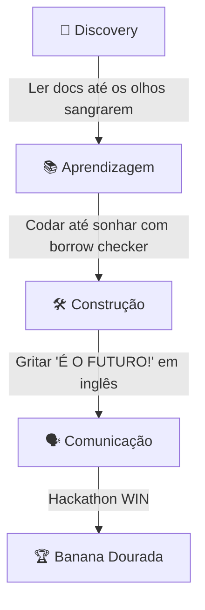
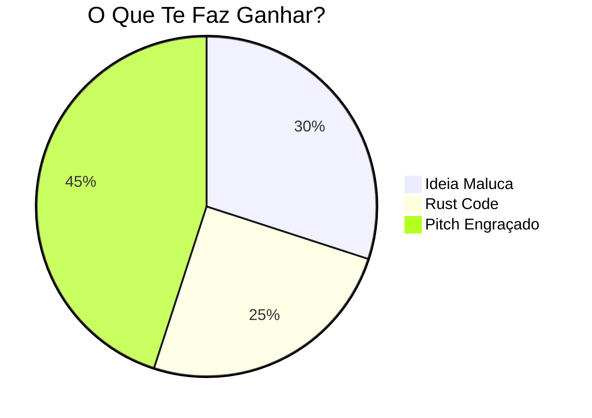

# 🚀 **ROADMAP TECNOLOUGIAAAAA!!** 🐘🦍  
*(Under Construction... mas já tá ficando brabo!)*  
# DONTPAD merdian7
https://dontpad.com/merdian7

```markdown
<div align="center">
  
  <h1>🌌 WEB3 + RUST + PITCH = HACKATHON WIN</h1>
  <p><b>Guia Primo Dumbo pra virar o Elefante mais tech da Stellar Meridian!</b></p>
</div>
```

## **📌 ETAPAS (ou "Como Não Virar Um Elefante Assustado")**


### **1️⃣ DISCOVERY (Semana 1-2)**  
*"Entender o que diabos é Stellar e não falar merda"*  
- [x] Ler whitepaper da Stellar (pelo menos o resumo)  
- [ ] Assistir 3 pitches de vencedores passados  
- [ ] Achar 5 projetos Rust/Web3 pra copiar *cough* se inspirar  
- [ ] Mapear quem sabe o quê no time (ex: "Você manja de tokens? Não? A gente se fudeu")  

```rust
// Exemplo de código útil pra essa fase:
fn entender_problema() -> Result<(), Erro> {
    if voce.perguntar("Por que blockchain?") == "Porque é hype" {
        panic!("🚨 Volta pro começo, animal!");
    }
    Ok(())
}
```

### **2️⃣ APRENDIZAGEM (Semana 3-4)**  
*"Agora que sabe que não sabe, vamos aprender"*  
- **Rustáceo Básico:**  
  - Ownership na veia (até sonhar com lifetimes)  
  - Smart contracts com `ink!` (sim, dá pra fazer NFT em Rust)  
- **Web3 Concepts:**  
  - Diferença Stellar vs Solana vs Ethereum (spoiler: é tudo confuso)  
  - Como não perder tokens pra golpe (hard mode)  
- **Produto:**  
  - UX pra quem não manja de crypto (ou seja, seu avô)  

```html
<details>
  <summary><b>📚 LIVROS QUE NINGUÉM LÊ MAS FICA BEM NO README</b></summary>
  <ul>
    <li>"Programming Web3 with Rust" (existe mesmo?)</li>
    <li>"Stellar for Dummies" (adaptado pra dumbos)</li>
    <li>"How to Pitch Without Crying" (leitura obrigatória)</li>
  </ul>
</details>
```

### **3️⃣ CONSTRUÇÃO (Semana 5-6)**  
*"Hora de botar no GitHub e rezar pro código compilar"*  
```rust
#[derive(Debug)]
struct ProjetoHackathon {
    ideia: String,          // Ex: "Uber mas com NFTs"
    codigo: Option<Vec<u8>>, // 50% chance de ser None
    pitch: bool             // False até o último dia
}

impl ProjetoHackathon {
    fn hackear(&mut self) {
        self.codigo = Some(vec![0xDE, 0xAD, 0xBE, 0xEF]);
        self.pitch = true; // Mentira, ninguém pratica
    }
}
```

**Checklist:**  
- [ ] Protótipo que "meio funciona"  
- [ ] Slide bonito (90% GIF, 10% conteúdo)  
- [ ] Testnet deployado (e perdido pra sempre)  

### **4️⃣ COMUNICAÇÃO (Semana 7)**  
*"Falar em público sem gaguejar (em inglês!)"*  
- **Pitch Training:**  
  - Gravar vídeo e chorar ao rever  
  - Treinar com timer (5min ou menos!)  
  - Frase de efeito tipo "Web3, but make it Rust"  
- **Inglês Técnico:**  
  - Aprender a dizer "scalability" sem travar  
  - Pronúncia de "Stellar" (não é "Estelar", seu bicho!)  

```markdown
<div style="background: #FFEE93; padding: 10px; border-radius: 10px;">
  <h3> 🎤 TEMPLATE DE PITCH (PRA NÃO TRAVAR)</h3>
  <ol>
    <li>"Problem: [Fala do mercado como se fosse o Messias]"</li>
    <li>"Solution: [Nosso troço resolve (mentira)]"</li>
    <li>"Why blockchain? [Fala 'descentralização' e torce]"</li>
    <li>"Demo: [Mostra GIF rodando localhost]"</li>
  </ol>
</div>
```

## **🏆 DESAFIO ALVO: MERIDIAN DA STELLAR**  


**Próximos Passos:**  
1. Achar um dev que já mexeu com Stellar (boa sorte)  
2. Não surtar quando o `cargo build` falhar  
3. Lembrar que até o Zuckerberg era um Dumbo no começo  

<div align="center">
  
  <p><em>"Compiler errors são só conselhos não solicitados"</em></p>
  <h2> 🍌 Vamos que Vamos, DUMBO TECH! 🚀</h2>
</div>
```


